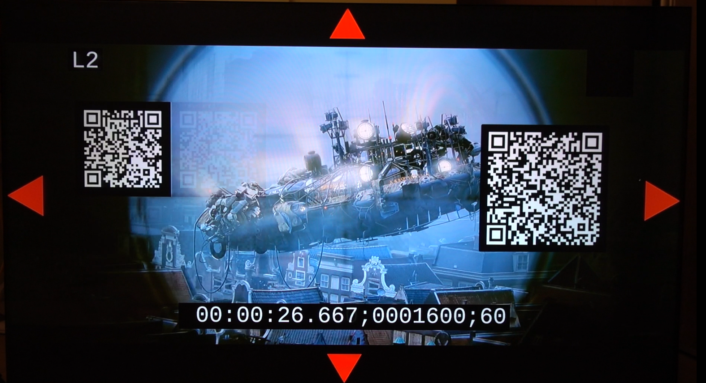
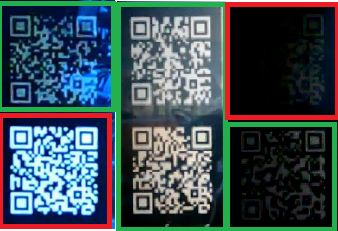

# CTA WAVE DPCTF Device Observation Framework

This repository contains the Device Observation Framework.
The DPCTF Device Observation Framework determines pass or fail results, based on observations of screen recordings of tests which are run on a device by the DPCTF Test Runner.

DPCTF is the Device Playback Compatibility Task Force of the CTA WAVE Project (see https://CTA.tech/WAVE and standards@CTA.tech for more info).

The current Observation Framework code is a work-in-progress interim release. The following instructions are intended to allow a user to set up and run the Observation Framework to validate the tool. Full instructions will be included in the final Phase 1 release.

## First set up DPCTF Test Runner

DPCTF Device Observation Framework **must** work together with the DPCTF Test Runner.
The DPCTF Test Runner should be set up prior to the DPCTF Device Observation Framework.
Please follow the instructions at https://github.com/cta-wave/dpctf-deploy.

**Check that the Test Runner is functioning correctly and able to run tests prior to installing the Observation Framework.**

## Setting up the Device Observation Framework

Currently this interim release has only been tested on Ubuntu 18.04 LTS.

Clone this github (i.e. https://github.com/cta-wave/device-observation-framework ) to the same machine/VM as the DPCTF Test Runner installation.

Observation Framework requires a number of packages and Python libraries to be installed.
First ensure that Python version 3.6+ is installed.

Then to set up the environment:

```shell
cd device-observation-framework
./setup_dev_environment.sh
```

This should install all required packages for the Observation Framework.


## Obtain recording files

The Observation Framework operates on recordings taken of the device's screen whilst running tests under the DPCTF Test Runner. These test materials contain QR codes which must be accurately captured for the Observation Framework to interpret.

### Camera requirements
For the Phase 1 Observation Framework a variety of cameras should be suitable. (**NOTE:** this will **not** be the case for Phase 2 which will likely require very specific camera model(s)... TBD.)

The camera's requirements are:
* produces an output recording file in a format compatible with the OpenCV library (typically a .mp4 or .mov format). Domestic cameras from Sony, Canon, GoPro, Fuji have been tried and all produced OpenCV compatible output.
* support recordings at a minimum of 119 frames per second at full HD.
* sufficient quality lens/sensor to allow sharp QR code capture at low resolutions on smallest screen device to be tested.

### Recording environment set up
The set up needs to be in a light-controlled environment and the camera configured to record high quality footage to allow consistent QR code detection. **It is highly unlikely that simply setting up the equipment on a desk in a standard office environment will produce satisfactory results!**

For the initial set up, in Test Runner select and run the "/avc/sequential-track-playback-manual__stream__.html" test. (See Test Runner documentation for how to run tests: https://github.com/cta-wave/dpctf-test-runner and https://web-platform-tests.org/running-tests/ ).

For the camera/device set up:
* The device needs to be in a light-controlled environment with no bright surrounding lights, and no glare or reflections on the device screen.
* The device needs to be mounted on a stable stand/support. The camera needs mounting on a stable tripod with lens pointing directly at the device screen at a 90 degree angle.
* The camera should be zoomed in to capture as large a display as possible, that contains all the image including the red edge markers.
* The camera should be manually focused on the device screen to produce a sharp image.
* The camera must be set to record at a minimum of 119 frames per second in full HD.
* The device's screen brightness needs to be adjusted to be neither too bright nor too dim. Too dim and the QR code cannot be discerned. But too bright and the white will "bleed" and prevent the QR code being recognised. See below for some examples.
* Depending on the device and sofware being used to run the tests, some device/software specific configuration may be required. For e.g. by default some browsers may add menu footers or headers that could partially obscure the QR codes. These will need to be set into e.g. a "full screen" mode. If any part of a QR code is obscured then the Observation Framework cannot operate.

### **Clear capture example:**



### **Examples of good and bad captures**
The QR codes outlined in GREEN were successfully decoded. Those outlined in RED failed to be decoded:



## Using the DPCTF Device Observation Framework
Once the device and camera setup is correct then Test Runner sessions can be analysed. See https://web-platform-tests.org/running-tests/ for instructions on how to run a test session. Prior to starting the session, begin the camera recording (ensuring that camera is set to record at minimum of 119 fps). Record the Test Runner session from begining to end and then stop the camera recording. Only one session may be contained in a single recording. A single session may contain multiple tests.

Once the recording is complete, follow the camera manufacturer's instructions to transfer the recorded file to the PC where Observation Framework is installed.

To run DPCTF Device Observation Framework enter:

```shell
cd device-observation-framework
python3 observation_framework.py --input <file_name>
```
where **file_name** specifies the path to the recorded file to be analysed.

The Observation Framework will analyse the recording and post the results to the Test Runner for viewing on Test Runner's results pages. Note that the observation processing may take considerable time, depending on the duration of the session recording.
At the end of the process the Observation Framework will rename the file recording to:
```<file_name>_dpctf_<session-id>.<extension>```

## Troubleshooting

### Http connection exception raised:
Check that Test Runner is installed and running without problems and that it is visible to the Observation Framework.

### Observation results are reporting large number of missing frames:
Check the quality of the recording. Ensure that the camera/device set up described earlier has been followed.

# Release Notes for Interim Release v0.2.0

This is an interim release for tool validation purposes.
Code was verified using Test Runner version:
* https://github.com/cta-wave/dpctf-deploy revision 43bfcd19683af64fbbbe2e19160c63515e0b3c92
* https://github.com/cta-wave/dpctf-tests revision d724f6df10ef6830102179183c66ba082a47ea3c
* https://github.com/cta-wave/dpctf-test-runner revision 75054f0a7fd4a675723507311f6dbdd2c5fd5509


## Implemented:
* Interim installation and usage instructions (in this README).
* Simple installation script.
* End-to-end Observation Framework functionality.
* Analysis of multiple tests in one session recording.
* Result reporting to DPCTF Test Runner.
* QR code based video tests implemented for:
  * 8.2  /avc/sequential-track-playback-manual__stream__.html
  * 8.3  /avc/random-access-to-fragment-manual__stream__.html
  * 8.4  /avc/random-access-to-time-manual__stream__.html
  * 8.6  /avc/regular-playback-of-chunked-content-manual__stream__.html
  * 8.7  /avc/regular-playback-of-chunked-content-non-aligned-append-manual__stream__.html
  * 8.9  /avc/out-of-order-loading-manual__stream__.html
  * 8.11 /avc/fullscreen-playback-of-switching-sets-manual__stream__.html
 

## TODO:
* Full installation and usage documentation, including how to add new test code and observations.
* Final installation steps.
* QR code based video tests to be implemented for:
  * 8.5 Switching Set Playback
  * 8.8 Playback over WAVE Baseline Splice Constraints
  * 8.10 Overlapping Fragments
  * 8.12 Playback of Encrypted Content
  * 8.13 Restricted Splicing of Encrypted Content
  * 8.14 Sequential Playback of Encrypted and Non-Encrypted Baseline Content
  * 9.2 Regular Playback of a CMAF Presentation
  * 9.3 Random Access of a WAVE Presentation
  * 9.4 Splicing of WAVE Program with Baseline Constraints

